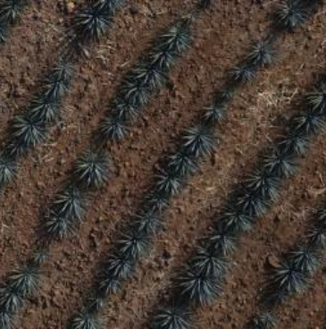
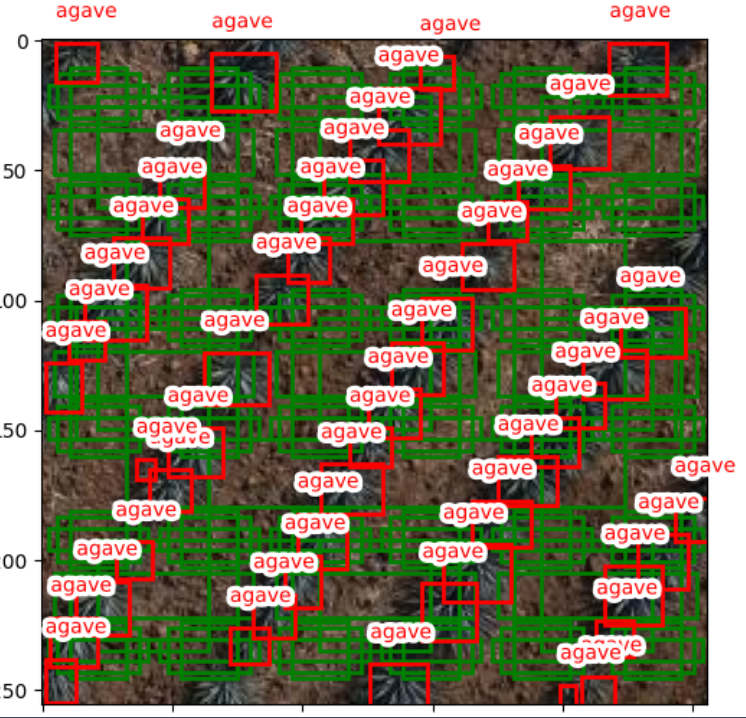
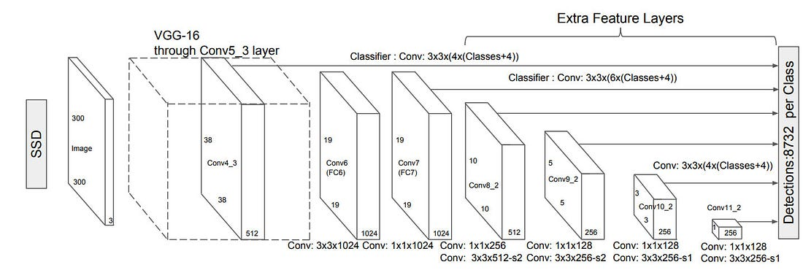
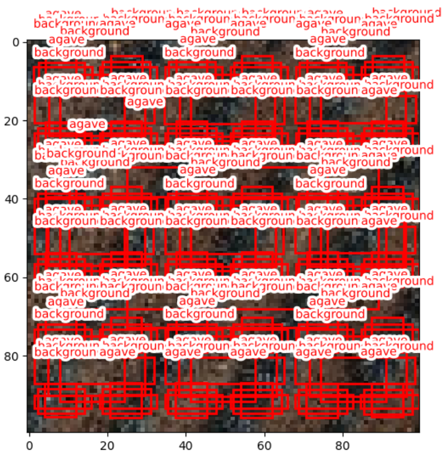
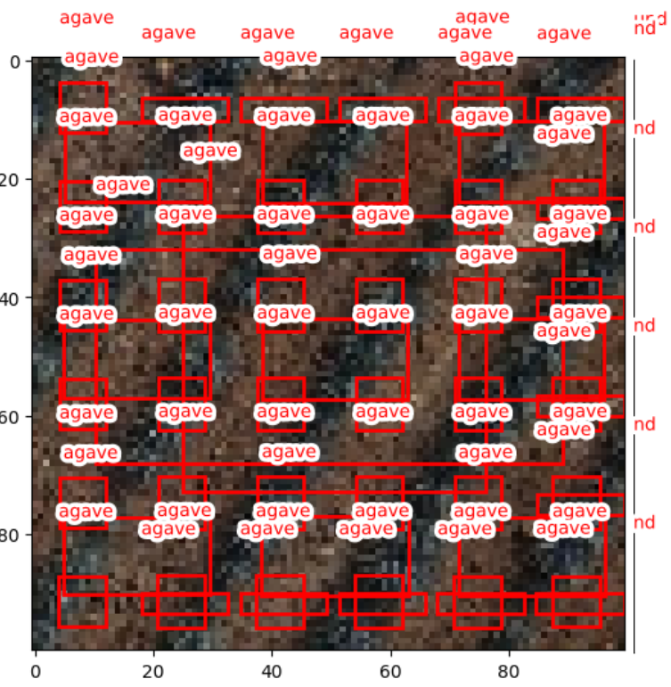

# SSD Agave Detection

Este proyecto implementa un modelo de detección de objetos Single Shot Multibox Detector (SSD) para detectar agaves en imágenes. Se utiliza PyTorch para construir y entrenar el modelo, y Albumentations para las transformaciones de datos.

## Instalación

Clona este repositorio:
```bash
    git clone https://github.com/romulotroncosop/SSD_agave.git
```
Asegúrate de tener instalado Python 3.11 o superior. Luego se sugiere instalar un entorno virtual
```bash
    pip install pipenv
    pipenv shell
```
Luego, instala las dependencias necesarias si se desea prescindir que el PipFile ligado al entorno virutal:

```bash
    pip install -r requirements.txt
```
Obtener el API key de Roboflow para descargar el dataset, despues crear un archivo llamado .env con el contenido

```python
    ROBOFLOW_API_KEY=N8s0v... # Tu api key de roboflow va aquí
    PYTHONPATH=.
```

Descargar el dataset 
```bash
    python -m utils.agave_dataset
```

Manualmente movel el dataset de /agaveHD-1 -> /data/datasets/agaveHD-1 o 
```bash
   mv agaveHD-1 data/datasets
```
Finalmente el entrenamiento e inerencia se corren con el comando

```bash
     python ssd_agave.py
```

## Estructura del Proyecto

- `utils/`
    - `agave_dataset.py`: Carga y preprocesa el dataset de agave.
    - `anchors.py`: Genera y visualiza las propuestas de cajas (anchors).
    - `ssd_model.py`: Define la arquitectura del modelo SSD.
    - `ssd_loss.py`: Implementa la función de pérdida para el entrenamiento del modelo SSD.
    - `ssd_train.py`: Contiene la función de entrenamiento.
    - `voc_dataset.py`: Funciones para cargar y visualizar el dataset VOC.

## Uso

### Cargar y Visualizar el Dataset
```python
    from utils.voc_dataset import get_sample, plot_anns
    from utils.voc_dataset import classes
    from utils.anchors import AnchorUtils
    import matplotlib.pyplot as plt

    # Obtener una muestra del dataset
    idx = 4445
    img_np, anns = get_sample(idx)

    # Visualizar la muestra
    plot_anns(img_np, anns)
    plt.show()
```


### Generar Anchors
```python
    scales = [6, 3, 1]
    centers = [(0.5, 0.5)]
    size_scales = [0.5]
    aspect_ratios = [(1., 1.), (1.5, 0.8), (1.8, 0.4)]
    sizes = [(s * a[0], s * a[1]) for s in size_scales for a in aspect_ratios]

    k, anchors, grid_size = AnchorUtils.generate_anchors(scales, centers, sizes)
    anchors = anchors.to(device)
    grid_size = grid_size.to(device)

    AnchorUtils.plot_anchors(img_np, anns, anchors, classes)
    plt.show()
```



### Definir el Modelo SSD
```python
    from utils.ssd_model import SSD

    n_classes = len(classes)
    k_values = [3, 3, 3]
    device = torch.device('cuda' if torch.cuda.is_available() else 'cpu')

    model = SSD(n_classes=n_classes, k=k_values).to(device)
    input_tensor = torch.rand((64, 3, 100, 100)).to(device)

    output = model(input_tensor)
    print(output[0].shape, output[1].shape)  # Esperado: torch.Size([64, 138, 4]) torch.Size([64, 138, 2])
```


### Calcular la Pérdida
```python
    from utils.ssd_loss import SSDLoss

    criterion = SSDLoss(
        anchors=anchors,
        grid_size=grid_size,
        threshold=0.4,
    )

    targets = (torch.rand((64, 5, 4)).to(device), torch.randint(0, n_classes, (64, 5)).to(device))
    loss = criterion(output, targets)
    print(f"Loss: {loss.item()}")

### Entrenar el Modelo

    from utils.ssd_train import fit

    trans = A.Compose([
        A.Resize(100, 100)
    ], bbox_params=A.BboxParams(format='pascal_voc', label_fields=['labels']))

    labels, bbs = anns
    augmented = trans(**{'image': img_np, 'bboxes': bbs, 'labels': labels})
    img, bbs, labels = augmented['image'], augmented['bboxes'], augmented['labels']

    img_tensor = torch.FloatTensor(img / 255.).permute(2,0,1).unsqueeze(0).to(device)
    bb_norm = [AnchorUtils.norm(bb, img.shape[:2]) for bb in bbs]
    bb_tensor = torch.FloatTensor(bb_norm).unsqueeze(0).to(device)
    label_tensor = torch.tensor(labels).long().unsqueeze(0).to(device)

    fit(model, img_tensor, (bb_tensor, label_tensor), epochs=100)
```

### Realizar Predicciones y Limpiar Fondo
```python
    from utils.ssd_loss import actn_to_bb
    import torchvision

    def predict(model, X):
        model.eval()
        with torch.no_grad():
            X = X.to(device)
            bbs, labels = model(X)
            bbs = actn_to_bb(bbs[0], anchors, grid_size)
        return bbs, torch.max(torch.softmax(labels, axis=2)[0].cpu(), axis=1)

    bbs, (scores, labels) = predict(model, img_tensor)

    # Filtrar los valores
    mask = labels > 0
    bbs = bbs[mask]
    labels = labels[mask]
    scores = scores[mask]

    # Mover los tensores filtrados a CUDA
    bbs = bbs.to(device)
    labels = labels.to(device)
    scores = scores.to(device)

    # Aplicar Non-Maximum Suppression (NMS)
    nms_ixs = torchvision.ops.nms(bbs, scores, iou_threshold=0.8)

    # Obtener los resultados después de NMS
    bbs, labels = bbs[nms_ixs], labels[nms_ixs]
    bbs = [AnchorUtils.unnorm(bb.cpu(), img.shape[:2]) for bb in bbs]
    plot_anns(img, (labels.cpu(), bbs))
    plt.show()
```

## Notas

- Este proyecto asume que tienes un conjunto de datos etiquetado con la clase "agave" en formato Pascal VOC.
- El modelo SSD está configurado para trabajar con imágenes de 100x100 píxeles.
- Se incluye un paso de Non-Maximum Suppression (NMS) para filtrar las predicciones redundantes.

Para cualquier duda o problema, por favor revisa la documentación y ejemplos proporcionados en el código fuente.
